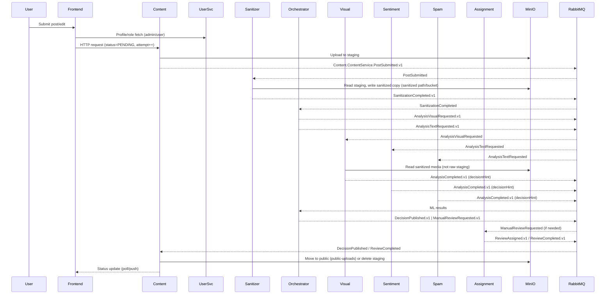

# Safe "Reddit" Forum – Distributed Moderation Implementation Plan

Version: 3.0 (Local Docker DNS, Event-Driven Microservices)

## Goals
- Keep user-generated content safe through automated + human-in-the-loop moderation.
- Decouple domains (User, Content, ML, Human Review) with asynchronous events.
- Run locally via Docker Compose while mirroring cloud patterns (S3-compatible storage, message bus).
- Allow users up to 3 revision attempts; posts remain non-public during review attempts and are removed after the 3rd failed decision.

## High-Level Architecture
- Event-driven microservices using RabbitMQ; services communicate via events, not direct coupling.
- Frontend talks directly to domain services (User, Content) on the Docker network; services scale independently.
- Orchestrated moderation saga coordinates ML fan-out/fan-in plus human escalation path.
- Storage split: relational data in Postgres; objects in MinIO (staging/private vs public/read-only).
- Redis holds transient saga/checklist state and retry counters.

## Architecture Diagram (Mermaid)
```mermaid
flowchart LR
    UI[Frontend (React)]
    subgraph ContentDomain
        CS[Content Service]
        MINIO[(MinIO\nstaging/public)]
        CDB[(Postgres\ncontent_db)]
    end
    subgraph SanitizationDomain
        SAN[Content Sanitization Service]
    end
    subgraph ModerationDomain
        ORCH[Moderation Orchestrator]
        REDIS[(Redis\nsaga state)]
        MDB[(Postgres\nmoderation_db)]
    end
    subgraph AssignmentDomain
        ASSIGN[Assignment Service]
        ADB[(Postgres\nassignment_db)]
    end
    subgraph MLDomain
        VIS[Visual Service]
        SENT[Sentiment Service]
        SPAM[Spam Service]
    end
    subgraph Infra
        MQ[(RabbitMQ)]
        UDB[(Postgres\nusers_db)]
    end

    UI --> CS
    UI --> US
    US --> UDB
    CS --> MQ
    MQ --> SAN
    SAN --> MQ
    MQ --> ORCH
    ORCH --> MQ
    MQ --> VIS & SENT & SPAM
    VIS & SENT & SPAM --> MQ --> ORCH
    ORCH --> MQ --> ASSIGN --> MQ --> CS

    CS --> MINIO
    VIS --> MINIO
    MINIO --> ORCH
    CS --> CDB
    ORCH --> MDB
    ASSIGN --> ADB
    GW --> UDB
    ORCH --> REDIS
```

## Services

### Infrastructure
- RabbitMQ: primary event bus (topic/fan-out exchanges).
- MinIO: S3-compatible storage with buckets `staging-uploads` (private) and `public-uploads` (public read).
- Redis: saga state, attempt counters, short-lived caches.
- PostgreSQL: `users_db`, `content_db`, `moderation_db`, `assignment_db`.

### Domain Services (Spring Boot unless noted)
- **User Service**  
  Profiles and basic role flags (admin vs normal user); emits `user.created`, `user.banned`. Full auth/JWT is out of scope for now.

- **Content Service (Producer)**  
  Threads/comments CRUD, file upload to staging, status tracking. Emits `content.submission.created`; listens for `moderation.decision.published` and `manual.review.completed`. Moves objects between staging/public or deletes on rejection/expiry. Maintains per-post attempt count (0–3) and hides content while in review.

- **Moderation Orchestrator**  
  Coordinates ML fan-out/fan-in, saga state in Redis, audit trail in `moderation_db`. Listens for `content.submission.created`, emits `analysis.visual.requested`, `analysis.text.requested`, aggregates `*.completed`, applies decision matrix. Emits `moderation.decision.published`. On low-confidence or timeout, emits `manual.review.requested`.

- **Human Review Assignment Service**  
  Assigns admin moderators when human action is needed. Listens for `manual.review.requested`, selects an admin randomly (workload balancing deferred), records assignment in `assignment_db`, emits `manual.review.assigned {postId, adminId}`. Receives `manual.review.actioned` from UI to finalize decision and emits `manual.review.completed`. No separate `/admin` surface is required—authorization/RBAC can gate these endpoints later when auth is added. Admin decisions flow via these evented endpoints; no extra admin API surface is needed.

- **Content Sanitization Service (Pre-ML)**  
  Cleans and normalizes content before ML. Listens for `Content.v1.PostSubmitted`, performs text normalization (strip control chars, collapse whitespace, language detect fallback), media hygiene (strip EXIF, downscale/convert to standard format), and emits `Sanitization.v1.Completed` with sanitized references. On failure, emits `Sanitization.v1.Failed` to trigger manual review or rejection.

- **ML Microservices (FastAPI/Python)**  
  - Visual Safety Service: listens `analysis.visual.requested`, emits `analysis.visual.completed` (NSFW/Gore).  
  - Sentiment Engine: listens `analysis.text.requested`, emits `analysis.sentiment.completed` (toxicity).  
  - Spam Guard: listens `analysis.text.requested`, emits `analysis.spam.completed` (spam/abuse).  
  Services read staging objects with internal creds.

- **Frontend (React)**  
  Submit/edit posts, show status, expose admin review UI, display attempt counter and rules.

## Bounded Contexts & Aggregates (DDD)
- **Content Context (Core)**: Aggregates `Post` (with `attempts`, `status`, `visibility`, `mediaRefs`) and `Comment`. Invariants: max 3 attempts unless published; only one active moderation case per post; pending/flagged content is hidden from public feed.
- **Moderation Context (Core)**: Aggregate `ModerationCase` tracking ML checklist, scores, decision, and whether manual review is required. Invariants: one case per post at a time; decisions are idempotent; timeout escalates to manual review once.
- **Assignment Context (Supporting)**: Aggregate `Assignment` (`postId`, `adminId`, `status`). Invariants: at most one open assignment per post; random admin selection; reassignment only on timeout/expiry.
- **User Directory (Supporting)**: Aggregate `UserProfile` (role flags). Auth deferred; roles used for admin UI gating.
- **ML Contexts (Supporting)**: Each model service owns its scoring logic and emits results; no shared DB.
- **Sanitization Context (Supporting)**: Aggregate `SanitizedPayload` (`postId`, pointers to cleaned text/media). Invariants: ML requests must reference sanitized artifacts; failed sanitization escalates or rejects.

## Event Names & Contracts
- Naming: `<Domain>.<Service>.<EventType>.v1`. Events carry `eventId`, `occurredAt`, `schemaVersion`.
- Event list (v1) with required fields and preconditions:
  - `Content.ContentService.PostSubmitted.v1`  
    Fields: `postId`, `userId`, `attempt`, `createdAt`, `mediaRefs` (uris), `status=PENDING_MODERATION`, `correlationId`.  
    Preconditions: attempt ≤3, post not already published/removed.
  - `Sanitization.Sanitizer.SanitizationCompleted.v1`  
    Fields: `postId`, `attempt`, `sanitizedTextUri?`, `sanitizedMediaUri?`, `contentHash`, `mimeType?`, `durationMs`, `correlationId`.  
    Preconditions: payload unchanged since submission (hash match), sanitization succeeded.
  - `Sanitization.Sanitizer.SanitizationFailed.v1`  
    Fields: `postId`, `attempt`, `reason`, `errorCode?`, `correlationId`.  
    Preconditions: sanitization attempted. Default policy: route to manual review; optional config can auto-reject with `REJECTED_SANITIZATION`.
  - `Moderation.Orchestrator.AnalysisVisualRequested.v1`  
    Fields: `postId`, `attempt`, `sanitizedMediaUri`, `contentHash`, `correlationId`.  
    Preconditions: sanitization completed with media present.
  - `Moderation.Orchestrator.AnalysisTextRequested.v1`  
    Fields: `postId`, `attempt`, `sanitizedTextUri`, `contentHash`, `correlationId`.  
    Preconditions: sanitization completed.
  - `ML.VisualService.AnalysisCompleted.v1`  
    Fields: `postId`, `attempt`, `label`, `score`, `decisionHint` (`AUTO_ALLOW|REVIEW|AUTO_REJECT`), `model`, `durationMs`, `correlationId`.  
    Preconditions: corresponding request seen.
  - `ML.SentimentService.AnalysisCompleted.v1`  
    Fields: `postId`, `attempt`, `label`, `score`, `decisionHint` (`AUTO_ALLOW|REVIEW|AUTO_REJECT`), `model`, `durationMs`, `correlationId`.  
    Preconditions: corresponding request seen.
  - `ML.SpamService.AnalysisCompleted.v1`  
    Fields: `postId`, `attempt`, `label`, `score`, `decisionHint` (`AUTO_ALLOW|REVIEW|AUTO_REJECT`), `model`, `durationMs`, `correlationId`.  
    Preconditions: corresponding request seen.
  - `Moderation.Orchestrator.DecisionPublished.v1`  
    Fields: `postId`, `attempt`, `status`, `reason`, `scores?`, `correlationId`, `thresholdConfigVersion?`.  
    Preconditions: case open and not terminal; idempotent on duplicate eventId. Include `thresholdConfigVersion` where applicable.
  - `Moderation.Orchestrator.ManualReviewRequested.v1`  
    Fields: `postId`, `attempt`, `reason`, `scores?`, `correlationId`.  
    Preconditions: case open; only one active manual review per post.
  - `Assignment.AssignmentService.ReviewAssigned.v1`  
    Fields: `postId`, `attempt`, `adminId`, `reassignment` (bool), `slaSeconds`, `correlationId`.  
    Preconditions: manual review requested; no active assignment or reassignment allowed.
  - `Assignment.AssignmentService.ReviewActioned.v1` (command result)  
    Fields: `postId`, `attempt`, `adminId`, `action` (`approve|reject|resubmit`), `notes?`, `correlationId`.  
    Preconditions: assignment exists and open.
  - `Assignment.AssignmentService.ReviewCompleted.v1`  
    Fields: `postId`, `attempt`, `status`, `adminId`, `notes?`, `correlationId`.  
    Preconditions: follows a valid action; closes assignment.

## Event Choreography (Saga)
1) **User Post**: User → Content Service. Content saves post (status `PENDING_MODERATION`, attempts++ when resubmitted), uploads to `staging-uploads`, emits `Content.ContentService.PostSubmitted.v1`.
2) **Sanitization**: Content Sanitization Service cleans text/media, emits `Sanitization.Sanitizer.SanitizationCompleted.v1` (or `SanitizationFailed.v1` -> default to manual review).
3) **Orchestration Trigger**: Orchestrator, on sanitization success, creates saga key `saga:post:{id}` with checklist and TTL (e.g., 60s). Emits `Moderation.Orchestrator.AnalysisVisualRequested.v1` and `Moderation.Orchestrator.AnalysisTextRequested.v1` referencing sanitized artifacts.
4) **Fan-Out**: ML services process and emit `ML.VisualService.AnalysisCompleted.v1`, `ML.SentimentService.AnalysisCompleted.v1`, `ML.SpamService.AnalysisCompleted.v1`.
4) **Fan-In**: Orchestrator updates saga state as results arrive. On all results or timeout, apply decision matrix.
5) **Decision**:  
   - Publish: emits `Moderation.Orchestrator.DecisionPublished.v1 {status: PUBLISHED}`.  
   - Reject (NSFW/SPAM/timeout rules): emits `Moderation.Orchestrator.DecisionPublished.v1 {status: REJECTED_*}`.  
   - Low confidence/flagged: emits `Moderation.Orchestrator.ManualReviewRequested.v1`.
6) **Human Review**: Assignment Service assigns admin and emits `Assignment.AssignmentService.ReviewAssigned.v1`. Admin UI actions emit `Assignment.AssignmentService.ReviewActioned.v1` -> Assignment Service emits `Assignment.AssignmentService.ReviewCompleted.v1` with final status. Content Service applies outcome.
7) **Content Update**: Content Service moves/deletes object and updates status: `PUBLISHED`, `REJECTED_*`, `AWAITING_MANUAL_REVIEW`, `REMOVED_AFTER_3_ATTEMPTS`.

## Data Flow Diagram (Mermaid)


## Attempt & Visibility Rules
- `attempts` per post stored in `content_db` and mirrored in Redis for quick checks.
- On each user edit/resubmit while not published: increment attempts (max 3), reset status to `PENDING_MODERATION`, re-emit pipeline.
- While pending, post is hidden from public feeds; visible only to author and admins.
- After 3 failed outcomes (any combination of rejects/manual rejections/timeouts), Content Service sets status `REMOVED_AFTER_3_ATTEMPTS`, deletes staging asset, and stops accepting edits.
- UI surfaces remaining attempts and guidance; backend enforces limits.

## Domain Policies & State Transitions
- **Content**:  
  - Transitions: `DRAFT|EDITABLE -> PENDING_MODERATION -> PUBLISHED|REJECTED_*|AWAITING_MANUAL_REVIEW`.  
  - Attempts: increment on each submission while not published; hard cap 3 => `REMOVED_AFTER_3_ATTEMPTS`. Manual rejection consumes an attempt; resubmit after manual request consumes an attempt; manual reviewer cannot bypass cap. Manual approval does not consume an extra attempt.
  - Visibility: only author/admin see pending/flagged; public sees only `PUBLISHED`.
- **Sanitization**:  
  - On `PostSubmitted`, sanitize text/media; on success, emit sanitized refs; on failure, default to manual review (`ManualReviewRequested`), optionally configurable to auto-reject with `REJECTED_SANITIZATION`.  
  - ML requests must reference sanitized assets; orchestrator blocks fan-out without sanitization success. Content detects hash mismatch on edits and re-emits `PostSubmitted` with updated hash to force re-sanitization.
  - Content computes `contentHash` as SHA-256 of canonicalized text plus media checksums (sorted, concatenated). Sanitization echoes the hash back; any edit that changes the hash invalidates prior sanitized artifacts.
- **Moderation**:  
  - Fan-out/fan-in to ML; each model uses two thresholds to emit a `decisionHint`: `AUTO_ALLOW` (below lower threshold), `AUTO_REJECT` (above upper threshold), `REVIEW` (in between). Calibrate thresholds per model from validation data; treat errors/timeouts as `REVIEW`.  
  - Decisioning: all `AUTO_ALLOW` -> `PUBLISHED`; any `AUTO_REJECT` -> corresponding `REJECTED_*`; any `REVIEW` or missing result -> `AWAITING_MANUAL_REVIEW` (once per case).  
  - Timeouts/ML errors set `decisionHint=REVIEW` with confidence=0 and proceed to manual review path.
- **Assignment**:  
  - On `ManualReviewRequested`, create `Assignment` with random admin, status `ASSIGNED`.  
  - On timeout/no response, reassign once and emit `Assignment.v1.ReviewAssigned` with `reassignment=true`.  
  - Admin actions emit `ReviewActioned` -> `ReviewCompleted` -> Content applies final status.
- **Timeouts**: Orchestrator timeout -> manual escalation; Assignment timeout -> one reassignment, second timeout auto-rejects with `REJECTED_REVIEW_TIMEOUT` and consumes an attempt; repeated failures count toward attempts.

### Aggregate State Transition Tables
**Post (Content Context)**
| From                | Command/Event                                  | To                          | Notes |
|---------------------|-----------------------------------------------|-----------------------------|-------|
| DRAFT/EDITABLE      | Submit -> PostSubmitted                        | PENDING_MODERATION          | attempt++ (≤3), set visibility hidden |
| PENDING_MODERATION  | DecisionPublished (PUBLISHED)                  | PUBLISHED                   | move to public bucket |
| PENDING_MODERATION  | DecisionPublished (REJECTED_*)                 | REJECTED_*                  | delete staging; attempt consumed |
| PENDING_MODERATION  | ManualReviewRequested                          | AWAITING_MANUAL_REVIEW      | hidden; waiting assignment |
| AWAITING_MANUAL_REVIEW | ReviewCompleted (approve)                   | PUBLISHED                   | move to public |
| AWAITING_MANUAL_REVIEW | ReviewCompleted (reject/resubmit)           | REJECTED_MANUAL or back to PENDING_MODERATION | resubmit counts as attempt; manual rejection consumes attempt |
| ANY non-PUBLISHED   | Attempts exceed 3                              | REMOVED_AFTER_3_ATTEMPTS    | delete staging; block edits |

**ModerationCase (Moderation Context)**
| From              | Event                                           | To                      | Notes |
|-------------------|-------------------------------------------------|-------------------------|-------|
| PendingSanitize   | SanitizationCompleted                           | AwaitingAnalysis        | store sanitized refs/hash |
| PendingSanitize   | SanitizationFailed                              | AWAITING_MANUAL_REVIEW (default)  | optional config: auto DecisionPublished(REJECTED_SANITIZATION) |
| AwaitingAnalysis  | Analysis*Requested                              | AwaitingResults         | checklist started |
| AwaitingResults   | AnalysisCompleted (all AUTO_ALLOW/AUTO_REJECT resolved) | Decided          | apply matrix -> decision published |
| AwaitingResults   | Any REVIEW hint or Timeout/Error                | AWAITING_MANUAL_REVIEW  | mark inconclusive; escalate once |
| AWAITING_MANUAL_REVIEW | ReviewCompleted                            | Decided                 | final status emitted |
| Decided           | any further events                              | Decided                 | idempotent ignore |

**Assignment (Assignment Context)**
| From        | Event                                    | To          | Notes |
|-------------|------------------------------------------|-------------|-------|
| Unassigned  | ManualReviewRequested                    | Assigned    | pick random admin |
| Assigned    | Timeout                                  | Assigned    | reassign once (reassignment=true) |
| Assigned    | Second Timeout                           | Closed      | emit auto DecisionPublished(REJECTED_REVIEW_TIMEOUT); consume attempt |
| Assigned    | ReviewActioned/ReviewCompleted           | Closed      | emit completed |
| Closed      | any                                      | Closed      | ignore duplicates |

**SanitizedPayload (Sanitization Context)**
| From          | Event                    | To          | Notes |
|---------------|--------------------------|-------------|-------|
| New           | SanitizationCompleted    | Sanitized   | immutable refs/hash |
| New           | SanitizationFailed       | Failed      | may escalate |
| Sanitized     | Content mutated (hash mismatch) | Invalidated | Content detects edit/hash change and re-emits PostSubmitted to re-sanitize |
| Any           | TTL expiry               | Expired     | re-sanitize on next attempt |

## Domain Models (by Context)
- **Content Context**
  - `Post`: `postId`, `userId`, `title`, `body`, `mediaRefs` (staging/public URIs), `status`, `attempts`, `createdAt`, `updatedAt`, `visibility`, `latestSanitizedHash`, `auditTrailIds`.
  - `Comment`: `commentId`, `postId`, `userId`, `body`, `status` (align to post rules), `createdAt`.
- **Sanitization Context**
  - `SanitizedPayload`: `postId`, `attempt`, `sanitizedTextUri?`, `sanitizedMediaUri?`, `contentHash`, `mimeType?`, `createdAt`, `expiresAt`, `status` (`Sanitized|Failed|Invalidated|Expired`).
- **Moderation Context**
  - `ModerationCase`: `postId`, `attempt`, `sanitizedRefs` (uris/hash), `checklist` (visual/text/spam states), `scores` (per service), `decisionHint` summary, `finalDecision`, `status` (`PendingSanitize|AwaitingAnalysis|AwaitingResults|ManualReview|Decided`), `createdAt`, `updatedAt`, `correlationId`.
  - `ModerationDecision`: value object with `status`, `reason`, `modelEvidence` (per service score/hint/model).
- **ML Contexts (per service)**
  - `AnalysisRequest`: `postId`, `attempt`, `sanitizedUri`, `contentHash`, `correlationId`.
  - `AnalysisResult`: `postId`, `attempt`, `label`, `score`, `decisionHint`, `model`, `durationMs`, `correlationId`, `occurredAt`.
- **Assignment Context**
  - `Assignment`: `postId`, `attempt`, `adminId`, `status` (`Assigned|Closed`), `reassignment` (bool), `slaSeconds`, `createdAt`, `updatedAt`, `notes?`.
- **User Directory**
  - `UserProfile`: `userId`, `role` (`admin|user|super-admin`), `createdAt`, `status`.

## Read Models / Projections
- Public Feed Projection (Content): only `PUBLISHED` posts, sorted by createdAt.
- Author Dashboard Projection: author-visible posts with status, attempt count, and reasons.
- Admin Review Queue Projection: pending manual cases with scores, reason, assigned admin.
- Moderation Audit Projection: per post history of decisions and events for traceability.

## Consistency & Concurrency
- Optimistic locking on `Post` and `ModerationCase` aggregates to avoid double decisions.
- Idempotency keys: `eventId` + `correlationId` stored in `moderation_db` and `content_db` to drop duplicates.
- Single active moderation case per post enforced by unique constraint; Content ignores extra decisions once terminal.
- Redis saga keys include version to prevent cross-version mixing; expire with TTL.
- Manual review reassignment requires checking assignment status to avoid split-brain actions.

## Decision Matrix (Orchestrator)
- Per-model thresholds produce a `decisionHint`:  
  - `AUTO_ALLOW`: score below lower threshold (e.g., NSFW <0.3, Spam <0.3, Toxicity <0.3).  
  - `AUTO_REJECT`: score above upper threshold (e.g., NSFW >0.8, Spam >0.8, Toxicity >0.7).  
  - `REVIEW`: between thresholds or on error/timeout (treated as uncertain/abstain).
- Aggregation:  
  - Any `AUTO_REJECT` -> reject with reason-specific status (e.g., `REJECTED_NSFW`, `REJECTED_SPAM`, `REJECTED_SANITIZATION` if configured, `REJECTED_REVIEW_TIMEOUT` on second assignment timeout).  
  - All `AUTO_ALLOW` -> `PUBLISHED`.  
  - Any `REVIEW` -> `AWAITING_MANUAL_REVIEW` and emit `ManualReviewRequested`; status remains hidden until manual decision.
  - Sanitization failure: default to manual review; optional config to issue `DecisionPublished(REJECTED_SANITIZATION)`.
- Manual reviewer can override to `PUBLISHED`, `REJECTED_MANUAL`, or request resubmission (counts as failed attempt).
- Thresholds: store default per-model thresholds and versions in `moderation_db` (e.g., `nsfw_lower=0.3`, `nsfw_upper=0.8`, `model_version=resnet50-v1`). Calibrate thresholds per model from validation data; include `thresholdConfigVersion` in ML results and decisions for reproducibility.

## Data Storage
- Postgres schemas:  
  - `users_db`: users, roles.  
  - `content_db`: posts, comments, status, attempts, audit trail (event ids).  
  - `moderation_db`: moderation logs, ML scores.  
  - `assignment_db`: admin roster, availability, assignments, SLAs.  
- MinIO object keys namespaced by post/thread; staging vs public separation.
- Redis: `saga:post:{id}` checklists, `attempts:{postId}` counters with TTL aligned to workflow.

## Operational Concerns
- Observability: distributed tracing (e.g., OpenTelemetry), logs with correlation ids per post id, metrics per stage (latency, failure rates).
- Idempotency: events carry correlation/sequence ids; Content Service guards against duplicate decisions.
- Security: keep services private to the compose network; least-privilege RabbitMQ users; signed MinIO URLs for internal access. Auth/JWT can be added later without altering event contracts.
- Timeouts/retries: bounded retries on ML services; orchestrator timeout promotes to manual review; dead-letter queues for poison messages.

## Implementation Phases
1) **Foundation**: docker-compose with Postgres, RabbitMQ, Redis, MinIO; scaffold User, Content services; leave auth stubbed for later.  
2) **Pipeline Backbone**: build Moderation Orchestrator; define exchanges/queues/bindings; implement content → orchestrator → ML request flow.  
3) **ML Services**: implement Visual Safety, Sentiment, Spam services; wire to RabbitMQ and MinIO.  
4) **Fan-In & Decisioning**: orchestrator aggregation, decision matrix, content reaction (publish/reject, file move).  
5) **Human Review Path**: Human Review Assignment Service, admin UI flows, events (`manual.review.*`), attempt counter enforcement.  
6) **UI & Monitoring**: React frontend for users/admins, tracing/metrics dashboards, operational runbooks.  
7) **Hardening**: load/perf testing, chaos/timeouts, security review, backups/retention policies.

## User Flows (Mermaid)
```mermaid
flowchart TD
    subgraph UserFlow
        A[Create/Update Post] --> B[Content saves PENDING + attempt++]
        B --> C[Sanitize content]
        C -->|fail| D[Mark AWAITING_MANUAL_REVIEW -> Manual Review path]
        C -->|pass| E[Orchestrator fan-out to ML]
        E --> F[Collect ML hints]
        F -->|all AUTO_ALLOW| G[PUBLISHED -> move to public]
        F -->|any AUTO_REJECT| H[REJECTED_* -> delete staging]
        F -->|any REVIEW/timeout| D[Manual Review path]
        D --> I[Assign admin]
        I --> J[Admin decision approve]
        I --> K[Admin decision reject]
        I --> L[Admin requests resubmit]
        J --> G
        K --> H
        L --> A[User edits/resubmits (attempt++ up to 3)]
        H -->|attempts >=3| M[REMOVED_AFTER_3_ATTEMPTS]
    end
```

## Quick Event Schema Sketch (JSON)
```json
// Content.ContentService.PostSubmitted.v1
{ "postId": "uuid", "userId": "uuid", "hasMedia": true, "attempt": 2, "createdAt": "iso8601" }

// ML.VisualService.AnalysisCompleted.v1 / ML.SentimentService.AnalysisCompleted.v1 / ML.SpamService.AnalysisCompleted.v1
{ "postId": "uuid", "score": 0.12, "decisionHint": "AUTO_ALLOW", "label": "safe", "model": "resnet50-v1", "durationMs": 42 }

// Moderation.Orchestrator.DecisionPublished.v1
{ "postId": "uuid", "status": "PUBLISHED", "reason": "clean", "attempt": 2 }

// Moderation.Orchestrator.ManualReviewRequested.v1
{ "postId": "uuid", "reason": "low_confidence", "scores": { "toxicity": 0.71 } }

// Assignment.AssignmentService.ReviewAssigned.v1
{ "postId": "uuid", "adminId": "uuid", "slaSeconds": 900 }

// Assignment.AssignmentService.ReviewCompleted.v1
{ "postId": "uuid", "status": "REJECTED_MANUAL", "notes": "confirmed spam" }
```
