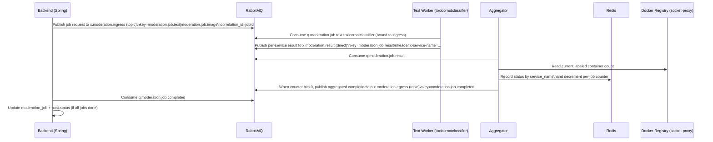

# Moderation Event Logic Findings

Scope: backend → text moderation worker(s) → moderation aggregator → backend.

This document captures how the current system works end-to-end, what contracts exist between services, and the highest-risk failure/edge cases I see in the current event logic.

## High-level Flow

## RabbitMQ Topology (as used today)

### Backend (producer + final consumer)

- Publishes moderation job requests:
  - Exchange: `x.moderation.ingress` (topic)
  - Routing keys:
    - `moderation.job.text`
    - `moderation.job.image`
  - Message properties:
    - `correlation_id = moderationJobId` (string)
    - `message_id = moderationJobId` (string)
- Consumes aggregated job completion:
  - Exchange: `x.moderation.egress` (topic)
  - Routing key: `moderation.job.completed`
  - Queue: `q.moderation.job.completed`

Sources:
- `backend/src/main/resources/application.yml`
- `backend/src/main/java/com/SafuForumBackend/moderation/config/ModerationAmqpConfig.java`
- `backend/src/main/java/com/SafuForumBackend/moderation/service/ModerationOrchestratorService.java`
- `backend/src/main/java/com/SafuForumBackend/moderation/service/ModerationJobCompletedListener.java`

### Text worker (`moderation_text_toxicornotclassifier`)

- Consumes:
  - Exchange: `x.moderation.ingress` (topic)
  - Routing key: `moderation.job.text`
  - Queue: `q.moderation.job.text.toxicornotclassifier`
- Publishes result events:
  - Exchange: `x.moderation.result` (direct)
  - Routing key: `moderation.job.result`
  - Queue (declared and bound): `q.moderation.job.result`
  - Message properties:
    - `correlation_id = incoming correlation_id OR moderationJobId`
    - `message_id = uuid5(namespace, f"{service}:{correlation_id}")` (stable per service+job)
    - headers: `x-service-name = SERVICE_NAME`
  - Uses publisher confirms and `mandatory=True` when publishing.

Sources:
- `moderation_text_toxicornotclassifier/app/events/rabbitmq.py`
- `moderation_text_toxicornotclassifier/app/settings.py`
- `../docker-compose.yml`

### Aggregator (`moderation_aggregator`)

- Consumes result events:
  - Exchange: `x.moderation.result` (direct)
  - Routing key: `moderation.job.result`
  - Queue: `q.moderation.job.result`
- Publishes aggregated completion:
  - Exchange: `x.moderation.egress` (topic)
  - Routing key: `moderation.job.completed`
  - Message properties:
    - `correlation_id = incoming correlation_id OR moderationJobId`
  - Uses publisher confirms, but does **not** check return value and does **not** use `mandatory=True`.

Sources:
- `moderation_aggregator/app/events/rabbitmq.py`
- `moderation_aggregator/app/settings.py`
- `../docker-compose.yml`

## Event Contracts (payload shapes)

### Job request (backend → worker)

Backend publishes `ModerationJobRequestedEvent`:
- `moderationJobId` (Long)
- `postId` (Long)
- `postVersion` (Integer)
- `sourceField` (String)
- `contentType` (`text`|`image`)
- `payload` (String)

Worker parses into `ModerationJob` (extra fields ignored, so `sourceField` is currently dropped by the worker):
- `moderationJobId` (int?)
- `postId` (int?)
- `postVersion` (int?)
- `contentType` (str?)
- `payload` (str)

Sources:
- `backend/src/main/java/com/SafuForumBackend/moderation/event/ModerationJobRequestedEvent.java`
- `moderation_text_toxicornotclassifier/app/domain.py`

### Per-service result (worker → aggregator)

Worker publishes `ModerationJobCompletedEvent`:
- `moderationJobId`
- `postId`
- `postVersion`
- `status` (`approved`|`rejected`|`failed`)
- `reason` (string)

Aggregator expects `ResultEvent`:
- `serviceName` (aka model field `service_name`) – injected from AMQP header `x-service-name`
- `moderationJobId`
- `postId`
- `postVersion`
- `status` (`pending`|`approved`|`rejected`|`failed`, defaults to `failed` on missing/invalid)

Notes:
- The aggregator currently **does not** store/aggregate `reason` from individual workers; it only stores statuses.

Sources:
- `moderation_text_toxicornotclassifier/app/domain.py`
- `moderation_text_toxicornotclassifier/app/events/rabbitmq.py`
- `moderation_aggregator/app/domain.py`
- `moderation_aggregator/app/events/service.py`

### Aggregated completion (aggregator → backend)

Aggregator publishes `JobCompletedEvent`:
- `moderationJobId`
- `postId`
- `postVersion`
- `status` (aggregated `approved`|`rejected`|`failed`)
- `reason` (currently `"Aggregated from N workers."`)

Backend consumes into `ModerationJobCompletedEvent`:
- `moderationJobId`
- `postId`
- `postVersion`
- `status` (enum `approved|rejected|failed|pending`)
- `reason`

Sources:
- `moderation_aggregator/app/domain.py`
- `backend/src/main/java/com/SafuForumBackend/moderation/event/ModerationJobCompletedEvent.java`
- `backend/src/main/java/com/SafuForumBackend/moderation/service/ModerationJobCompletedListener.java`

## Backend Lifecycle / State Machine

### Job creation + publish timing

- Jobs are created and saved in the same DB transaction as the post changes.
- Publishing to RabbitMQ happens **after commit** via `AfterCommitExecutor`, reducing “published but not persisted” inconsistencies.

Source:
- `backend/src/main/java/com/SafuForumBackend/moderation/service/ModerationOrchestratorService.java`
- `backend/src/main/java/com/SafuForumBackend/moderation/service/AfterCommitExecutor.java`

### Job completion processing

Backend listener behavior (important idempotency + staleness checks):
- Resolves job ID from:
  - body field `moderationJobId` OR
  - AMQP header `correlation_id`
- Drops completion if:
  - job id missing
  - unknown job id
  - job status in DB is not `pending` (idempotency)
  - post version no longer matches job’s `postVersion` (stale update)
- When a job completion is accepted:
  - updates job status + errorMessage/reason
  - recomputes post status for that post+version only when **all jobs** are no longer `pending`

Source:
- `backend/src/main/java/com/SafuForumBackend/moderation/service/ModerationJobCompletedListener.java`

### Timeout behavior

- Backend fails `pending` jobs older than `moderation.orchestrator.job-timeout` (default 10m).
- If the post is still `pending`, the post status is forced to `failed`.

Source:
- `backend/src/main/java/com/SafuForumBackend/moderation/service/ModerationTimeoutScheduler.java`

## Findings (Risks / Edge Cases)

### 1) Aggregator decrement is not deduplicated (can finalize early)

The aggregator decrements the per-job counter on **every** result message, even if it’s a duplicate message from the same service.

Consequence:
- With at-least-once delivery / redeliveries, a single worker can cause the counter to hit 0 early.
- Final status could be computed from an incomplete set of services.

Source:
- `moderation_aggregator/app/events/service.py`

### 2) Aggregator deletes Redis state before publish is known to be durable/routable

In the “remaining == 0” path, `_finalize()` deletes the Redis hash + counter before the AMQP publish happens.

Consequence:
- If publishing the final event fails, the input message is nacked (`requeue=False`) and the aggregation state is already gone. This can drop completion forever until the backend timeout flips the job/post to `failed`.

Sources:
- `moderation_aggregator/app/events/service.py`
- `moderation_aggregator/app/events/rabbitmq.py`

### 3) Aggregator uses container count as “expected workers” (job-type mismatch risk)

Expected count is derived from Docker label count (`domain=moderation`) at first-seen event.

Consequence:
- If/when you add *multiple* moderation services (e.g., text + image + something else), not every service will emit a result for every job type unless they’re all subscribed to all job types.
- Example: An image-only service won’t publish results for text jobs → aggregator waits forever (or until Redis TTL) because expected count is too high.

Sources:
- `moderation_aggregator/app/events/docker_registry.py`
- `moderation_aggregator/app/events/service.py`
- `../docker-compose.yml` (labels)

### 4) Image moderation jobs exist in backend but there is no image worker in compose

Backend will emit `moderation.job.image` for image URLs, but `../docker-compose.yml` currently only defines a text worker queue binding.

Consequence:
- Posts with images will generate at least one image moderation job that will never complete → post will be marked `failed` after timeout.

Sources:
- `backend/src/main/java/com/SafuForumBackend/moderation/service/PostModerationJobFactory.java`
- `backend/src/main/resources/application.yml`
- `../docker-compose.yml`

### 5) “Reason” context is lost at aggregation boundary

Worker emits a useful `reason` (e.g., model score), but aggregator only aggregates statuses and replaces reason with `"Aggregated from N workers."`.

Consequence:
- Backend DB loses model-level explainability that could be useful for ops/debugging/mod tooling.

Sources:
- `moderation_text_toxicornotclassifier/app/inference/service.py`
- `moderation_aggregator/app/events/service.py`

### 6) Final publish does not enforce routability or check confirm status

Aggregator’s `_publish_final()` does not use `mandatory=True` and ignores the boolean return from `basic_publish` (publisher confirms are enabled, but result is ignored).

Consequence:
- “Successfully published” may not mean “routed to a queue”. If the backend queue/binding doesn’t exist yet (startup ordering), the completion could be lost.

Source:
- `moderation_aggregator/app/events/rabbitmq.py`

### 7) Expected worker count = 0 can lead to negative “remaining” forever

If DockerRegistry returns 0 due to transient sync issues, the Lua script sets count to 0 and then decrements to -1.

Consequence:
- Aggregation never reaches remaining==0 → no completion emitted.

Source:
- `moderation_aggregator/app/events/service.py`
- `moderation_aggregator/app/events/docker_registry.py`

## Recommendations (Prioritized)

1) **Make aggregation idempotent per (correlation_id, service_name)**  
   Only decrement when the service’s result is first-seen for that job.

2) **Make “finalize + publish + cleanup” safe**  
   Do not delete Redis state until publish is confirmed and routable; consider storing a “final event” blob for retry.

3) **Replace “expected_workers = container count” with explicit “expected services”**  
   Options:
   - Include `expectedServices` in the job request event.
   - Maintain a registry/config per job type (text/image) of which services must report.
   - Have every service publish an explicit “skipped/not_applicable” result for job types it doesn’t handle (less ideal, but simple).

4) **Address image jobs**  
   Either:
   - add an image worker service, or
   - stop emitting image moderation jobs until one exists, or
   - treat images as out-of-band moderation (and don’t block post status on them).

5) **Preserve per-service reasons**  
   At least include a compact summary in the aggregated completion (or store per-service reasons in Redis and include them).

## Quick Verification Checklist (manual)

- Create a post with only text (no images):
  - expect only text jobs → success path should complete quickly
- Create a post with images:
  - current system will enqueue image jobs → expect backend to time out and set post to `failed`
- Kill/restart the text worker mid-stream:
  - ensure backend timeout behaves as intended
- Simulate duplicate result deliveries:
  - current aggregator may finalize early (this is a known risk)

